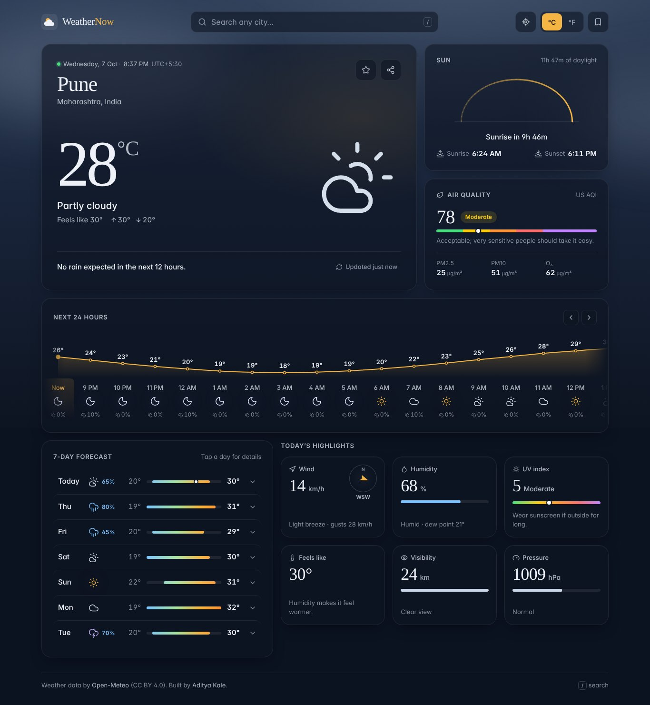
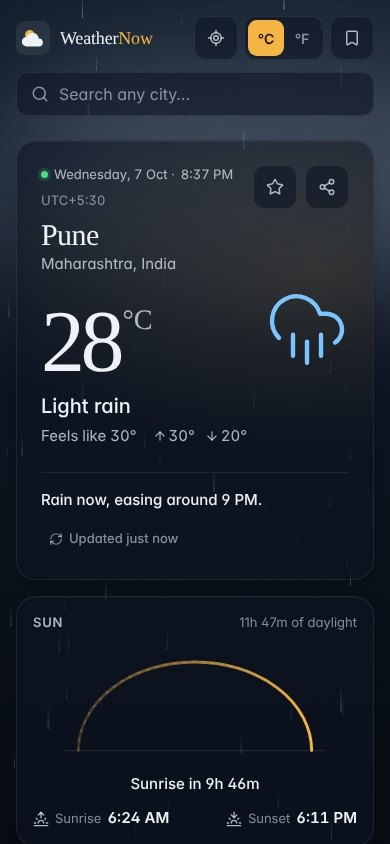

<div align="center">

# ☁️ WeatherNow

**A fast, animated real-time weather dashboard built with React, Vite and Framer Motion.**

Search any city in the world and get current conditions, a 24-hour temperature chart, a 7-day forecast, air quality, sunrise/sunset and more, on a sky that changes with the weather.

[](https://react.dev)
[](https://vite.dev)
[](https://motion.dev)
[](https://open-meteo.com)
[](LICENSE)

**[Live demo](https://adityak0012.github.io/weather-dashboard/)**



</div>

---

## ✨ Features

**Weather data**
- 🔎 **City search with live suggestions.** Type 2+ letters to see matching cities worldwide. Works fully with the keyboard (↑ ↓ Enter Esc), and pressing <kbd>/</kbd> anywhere focuses the search.
- 📍 **Use my location.** One tap uses your browser's location (with a readable place name).
- 🌡️ **Current conditions:** temperature, "feels like", today's high/low, the city's **local time** and time zone, and a one-line summary such as *"Rain likely around 4 PM (60% chance)"*.
- 📈 **Next 24 hours:** a smooth, animated temperature curve with icons and the chance of rain for each hour.
- 📅 **7-day forecast:** temperature range bars on a shared scale, rain chance, and a panel for each day (tap to open) with sunrise, sunset, rainfall, max wind and max UV.
- 🌬️ **Highlights:** wind (with an animated compass and gusts), humidity and dew point, UV index with advice, feels like, visibility and pressure.
- ☀️ **Sun tracker:** an arc showing where the sun is now, hours of daylight, and a countdown to the next sunrise or sunset.
- 🍃 **Air quality:** US AQI with a colour scale and health advice, plus PM2.5, PM10 and ozone.

**Personalisation**
- ⭐ **Saved cities.** Star a city to save it. The saved-cities drawer shows live temperatures for all of them and supports **drag-to-reorder**.
- 🕘 **Recent searches** appear when you focus the search box.
- 🌡️ **°C / °F toggle.** Wind, visibility, pressure and rainfall switch units too, and the change is instant (no extra request).
- 💾 Everything (units, saved cities, last city) is remembered in `localStorage`.
- 🔗 **Shareable links.** The URL always points to the current city (`?lat=…&lon=…&name=…`), and the share button copies it.

**Experience**
- 🎨 **Living background.** The sky gradient changes with the conditions and time of day: sun glow, stars at night, drifting clouds, rain, snow and lightning.
- 🎬 **Framer Motion animations:** staggered page entrance, spring-animated temperature numbers, a sliding unit toggle (`layoutId`), expanding forecast rows (`AnimatePresence`), a spring-loaded drawer, a draggable list (`Reorder`), and animated chart lines and gauges.
- 🔄 **Auto-refresh** every 10 minutes and when you return to the tab, with a manual refresh button and "Updated 3 min ago" label.
- ⏳ **Proper loading, empty and error states:** skeleton screens on first load, a retry screen if the service is down, and a toast message if a background refresh fails (the old data stays on screen).
- ♿ **Accessible:** semantic HTML, ARIA combobox for search, keyboard-friendly controls, visible focus rings, screen-reader text for the charts, and support for the system **Reduce motion** setting.
- 📱 **Responsive** from 360 px phones to wide desktop screens.
- 🔑 **No API key needed.**

<p align="center">
  
</p>

---

## 🛠️ Tech stack

| Area | Tools |
| --- | --- |
| UI | [React 19](https://react.dev) |
| Build tool | [Vite](https://vite.dev) |
| Animation | [Framer Motion](https://motion.dev) |
| Icons | [Lucide](https://lucide.dev) |
| Weather, air quality and city search | [Open-Meteo](https://open-meteo.com) (free, no key) |
| Place name for "my location" | [BigDataCloud reverse geocoding](https://www.bigdatacloud.com/free-api/free-reverse-geocode-to-city-api) (free, no key) |
| Styling | Plain CSS with design tokens (CSS custom properties) |
| Fonts | Fraunces (display) and Inter (interface) |

---

## 🚀 Getting started

**Requirements:** [Node.js](https://nodejs.org) 20.19+ or 22.12+.

```bash
# 1. Clone the repository
git clone https://github.com/Adityak0012/weather-dashboard.git
cd weather-dashboard

# 2. Install dependencies
npm install

# 3. Start the development server
npm run dev
```

Then open the address printed in the terminal (usually http://localhost:5173).

### Other commands

| Command | What it does |
| --- | --- |
| `npm run dev` | Starts the dev server with hot reload |
| `npm run build` | Creates an optimised production build in `dist/` |
| `npm run preview` | Serves the production build locally to check it |

---

## 🌍 Deploying to GitHub Pages

This repo includes a GitHub Actions workflow (`.github/workflows/deploy.yml`) that builds and publishes the site on every push to `main`.

1. Push the code to GitHub.
2. Open your repo's **Settings → Pages**.
3. Under **Build and deployment → Source**, choose **GitHub Actions**.
4. Wait for the **Deploy to GitHub Pages** action to finish (see the **Actions** tab).

Your site will be live at `https://<your-username>.github.io/weather-dashboard/`.

The app also works on Netlify or Vercel: use the build command `npm run build` and the output folder `dist`.

---

## 📁 Project structure

```
weather-dashboard/
├── index.html                 # HTML entry point (fonts, meta tags)
├── public/favicon.svg
├── src/
│   ├── main.jsx               # React entry point
│   ├── App.jsx                # Page layout, state, location, saved cities, URL sharing
│   ├── index.css              # Design tokens and all styles
│   ├── hooks/
│   │   └── hooks.js           # useWeather (fetch + auto-refresh), useLocalStorage, useDebounce, useNow
│   ├── lib/
│   │   ├── api.js             # Open-Meteo forecast, air quality, geocoding
│   │   ├── weatherCodes.js    # WMO weather codes → labels, icons, background scenes
│   │   ├── insights.js        # Plain-English labels (UV advice, AQI level, rain summary…)
│   │   ├── units.js           # °C/°F, km/h/mph, km/mi, hPa/inHg conversions
│   │   └── time.js            # City-local time helpers
│   └── components/
│       ├── Background.jsx     # Animated sky (rain, snow, stars, lightning)
│       ├── Header.jsx         # Logo, search, location, unit toggle, saved button
│       ├── SearchBar.jsx      # Autocomplete combobox
│       ├── CurrentCard.jsx    # Main current-weather card
│       ├── HourlyForecast.jsx # 24-hour SVG temperature chart
│       ├── DailyForecast.jsx  # 7-day list with expandable details
│       ├── Highlights.jsx     # Wind, humidity, UV, feels like, visibility, pressure
│       ├── SunCard.jsx        # Sunrise/sunset arc
│       ├── AirQualityCard.jsx # US AQI
│       ├── SavedDrawer.jsx    # Saved cities with drag-to-reorder
│       ├── AnimatedNumber.jsx # Spring-animated numbers
│       ├── WeatherIcon.jsx    # Weather code → icon
│       └── States.jsx         # Skeleton, error, toast, progress bar
├── docs/                      # README screenshots
└── .github/workflows/deploy.yml
```

---

## ⚙️ How it works

1. **Search.** As you type, `SearchBar` calls the Open-Meteo **Geocoding API** (debounced by 250 ms) and shows matching cities.
2. **Fetch.** When a city is picked, `useWeather` requests the **Forecast API** (current, hourly and daily data) and the **Air Quality API** in parallel. Data is always requested in metric units and converted in the browser, so the °C/°F toggle is instant.
3. **Local time.** Requests use `timezone=auto`, so times come back in the city's own time zone. `lib/time.js` reads them as the city's wall-clock time, which means "Sunset in 2h 10m" is correct even when you look at a city on the other side of the world.
4. **Display.** Weather codes are mapped to labels, icons and a background "scene" (`clear-day`, `rain-night`…), and components animate in with Framer Motion.
5. **Stay fresh.** Data refreshes every 10 minutes while the tab is visible. In-flight requests are cancelled with `AbortController` when you switch cities, so a slow old response never overwrites a new one.

---

## 🗺️ Ideas for the future

- Weather alerts and severe-weather warnings
- Hourly precipitation radar map
- Light theme
- Installable PWA with offline support

---

## 🙏 Credits

- Weather, air quality and geocoding data from [Open-Meteo](https://open-meteo.com), licensed under [CC BY 4.0](https://creativecommons.org/licenses/by/4.0/).
- Icons from [Lucide](https://lucide.dev).

## 📄 License

Released under the [MIT License](LICENSE).

---

<div align="center">

Made by **Aditya Kale** · [GitHub](https://github.com/Adityak0012) · [LinkedIn](https://www.linkedin.com/in/adityak0012)

</div>
